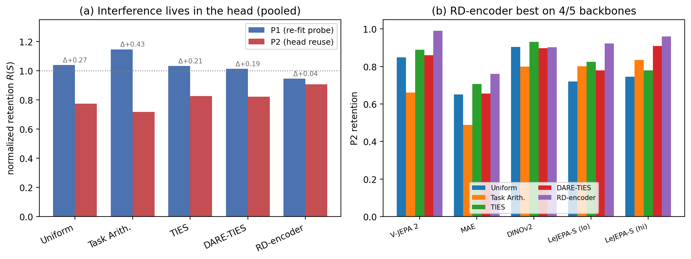

# Adapter Merging on JEPA Backbones

Code and data release for the preprint **"Adapter Merging on JEPA Backbones:
Interference Lives in the Head, and a Rate–Distortion-Optimal Encoder Recovers
It"** (Pathak & Garg, 2026). Paper source in [`paper/`](paper/).

## Findings (5 backbones, 50 merges)

- **Interference localization.** At $k=2$, weight-space merging of LoRA
  adapters preserves linearly-decodable features (a re-fit linear probe, P1,
  stays at ceiling, mean retention 1.04) but breaks original-head
  compatibility (P2 drops 15–24 points). The P1–P2 gap is significant (paired
  Wilcoxon $p = 6.8\times10^{-7}$).
- **A head-preserving merger.** A rate–distortion-optimal encoder (RD-encoder)
  has the smallest P1–P2 gap of any method, is the best merger on P2 for four
  of five backbones, and beats task arithmetic on P2 by +0.19 (95% CI
  [0.09, 0.28]). DINOv2, which merges unusually well under all methods, is the
  exception.



## Layout

```
src/isomerge/   importable library: dataset layer, encoder wrappers, custom
                LoRA, SIGReg, five mergers, isotropy/geometry metric suite,
                P1/P2 eval + retention statistics, LeJEPA pretraining harness
scripts/        pipeline (finetune_lora, merge_eval, pretrain_lejepa,
                geometry_profile, make_manifest) + analysis (analyze_pivot,
                make_figures)
configs/        the experimental grid
results/        per-merge JSON backing every number, plus the report tables
paper/          LaTeX source, references, main figure
tests/          script-based tests (no pytest): metrics vs synthetic ground
                truth, SIGReg, LoRA roundtrip, mergers, end-to-end on CPU
```

## Reproduce the paper numbers and figure

The released `results/` contains the per-merge JSON for all 50 C0 merges.
Regenerate the tables and figure from them:

```bash
python -m venv .venv && . .venv/bin/activate
pip install -e .                       # torch, timm, scikit-learn, ...
python scripts/analyze_pivot.py        # -> results/reports/pivot/{tables.json,summary.txt}
python scripts/make_figures.py         # -> paper/fig_localization.{pdf,png}
```

Run the test suite (CPU, ~3 min): `python tests/run_all.py`.

## Re-run experiments from scratch

`scripts/finetune_lora.py`, `merge_eval.py`, `pretrain_lejepa.py`, and
`geometry_profile.py` are single-cell entry points; `make_manifest.py`
enumerates the grid in `configs/grid.yaml` and `pbs/orchestrator.py` is a
simple done-file work-queue to drive them across GPUs. Large artifacts
(adapter checkpoints, pretrained backbones) are not in git; they are archived
with the Zenodo record.

## Build the paper

```bash
cd paper && pdflatex main && bibtex main && pdflatex main && pdflatex main
```

## Citation

See [`CITATION.cff`](CITATION.cff). Archived on Zenodo with a versioned DOI.

## License

Code is released under the MIT License ([`LICENSE`](LICENSE)); the paper text
and figures are CC-BY-4.0.
